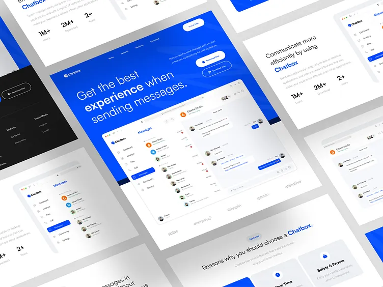
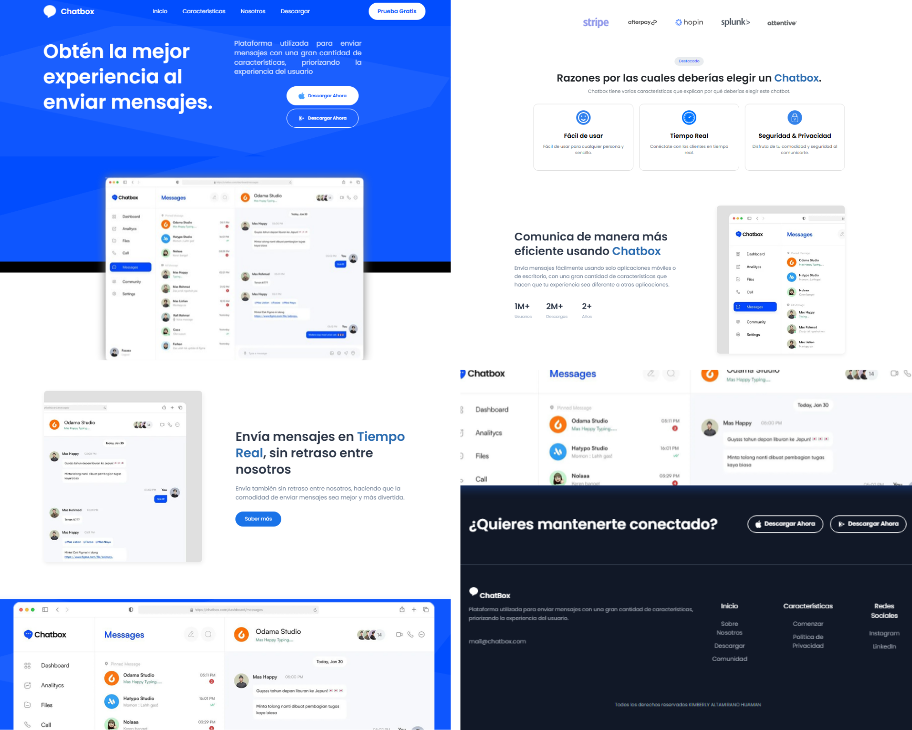
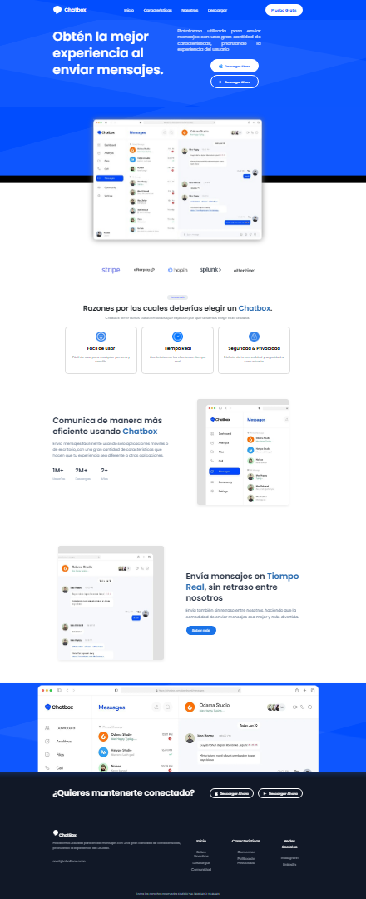

### Chatbox Web Responsivo Basado en Mockup

- Este repositorio implementa un diseño web responsivo basado en un mockup utilizando HTML, CSS, Bootstrap y JavaScript. El proyecto asegura una visualización óptima en dispositivos móviles, tabletas y escritorio, ofreciendo una experiencia de usuario intuitiva y elegante.

## **Características del Proyecto**

- **Diseño Responsivo**: Utiliza **media queries** para adaptar el contenido a diferentes dispositivos (móviles, tabletas y escritorios). Esto garantiza una experiencia de usuario fluida y agradable en cualquier tamaño de pantalla.
  
- **Navegación Clara y Funcional**: Una barra de navegación intuitiva con enlaces que se ajustan dinámicamente según el dispositivo. Ideal para facilitar la navegación.

- **Botones con Efectos de Transición**: Los botones incluyen efectos suaves de hover, mejorando la interacción del usuario y haciendo que el sitio sea más atractivo visualmente.

- **Sección Hero Destacada**: La página incluye una sección hero con texto introductorio y botones de acción prominentes, diseñada para captar la atención del usuario desde el inicio.

---

## Instalación por Github y por Plataforma

1. Clona el repositorio:
   ```sh
   git clone https://github.com/KimberlyA28/Chatbox-Buho.git
   ```
2. Por Ngrok
   ```sh
   http://localhost:5501/
   ```

---

### **Descripción de los Archivos**

- **`index.html`**: Contiene la estructura básica de la página, con los elementos HTML esenciales para la maquetación.
- **`mainStyle.css`**: Archivos CSS que definen el diseño visual de la página, incluidos los estilos generales y las reglas responsivas para una correcta visualización en dispositivos de diferentes tamaños.
- **`images-iconos/`**: Directorio que incluye todas las imágenes necesarias para el proyecto, como iconos, fondos y otros elementos visuales.

---

## Créditos

Desarrollado por [KimberlyA28](https://github.com/KimberlyA28).

---

### **Notas sobre las Imágenes**

- Diseño Completo: Esta imagen muestra el diseño original del mockup, que sirvió como base para la maquetación.



- Diseño Parcial: Aquí se muestra el diseño realizado hasta el momento, dividido en partes para un mejor enfoque visual.



- Vista Final del Diseño: Esta imagen presenta la versión final del diseño, con todas las modificaciones solicitadas, incluyendo animaciones y la traducción al español.

